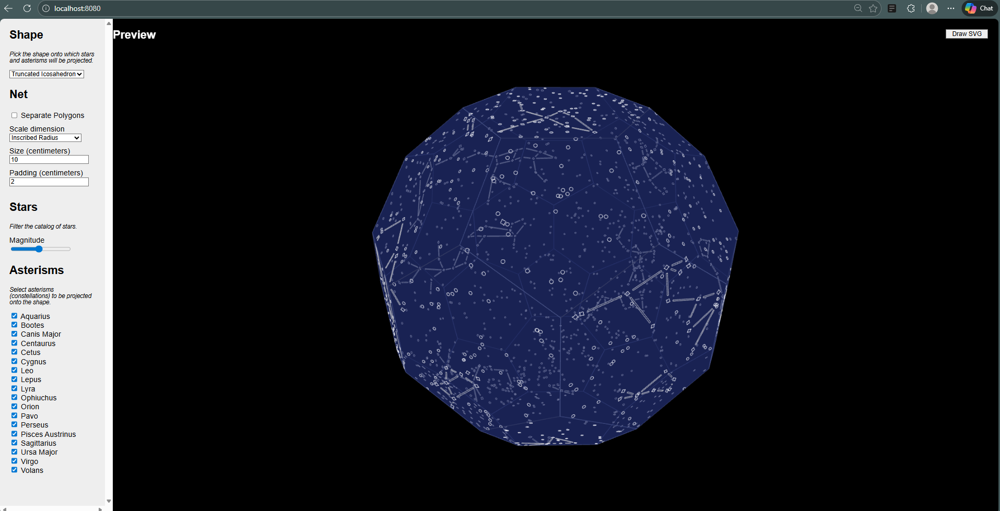

# Star Mapping 
## Truncated Icosahedron

This readme needs work but it should at least be informative.

## About

This application is a tool to generate a 3D preview and 2D laser-cutting
template of custom selections of stars and constellations projected onto a
polyhedron of your choice. Stars data comes from actual astrometric
catalogues and includes accurate positions and enables filtering based on
apparent brightness.

Projecting onto a polyhedron means we can easily "un-fold" the projected results
into a 2D template for cutting and then re-fold that into a physical 3D shape.

### Available Geometries

The following shapes are available for projection:

- **Tetrahedron** — 4 triangular faces
- **Cube** — 6 square faces
- **Octahedron** — 8 triangular faces
- **Dodecahedron** — 12 pentagonal faces
- **Icosahedron** — 20 triangular faces
- **Truncated Icosahedron** — 32 faces (12 pentagons + 20 hexagons, the classic soccer ball shape)

The first five are Platonic solids (all faces identical). The truncated
icosahedron is an Archimedean solid with two types of faces, providing a
rounder shape with more surface area for star projections.

The final result is allowing a light source (ideally
very small, bright, and omni-directional) to project individual points of light
onto the walls and ceiling of a room.

## Usage

### Customization

The tool will start up with default selections for the target shape, minimum
brightness level, and constellations. Any of these can be modified to and the
results will be re-projected in the preview pane automatically.

**Note:** the full catalogue includes over 98k stars. Not only can it take quite
a while to project the entire selection, but most of them are very faint stars
(meaning you likely wouldn't recognize them) and they would be bunched very
close together. The latter can be especially problematic due to overlapping
cuts: without manual (tedious!) cleanup you could end up with a ring of
connected stars causing a section of the projector to be unintentionally cut
out. Think of the island in a stencil of the letter "O".

The list of constellations is pre-filtered to only count those that are
"interesting". The full list maps out 88 constellations and you might be
surprised how many of them look like a simple line. My filter requires that a
constellation includes at least one star that connects to at least 3 other
stars.

You can visualize what it's like to unfold the 3D shape by clicking on it. It
looks neat but doesn't actually serve much of a purpose.
